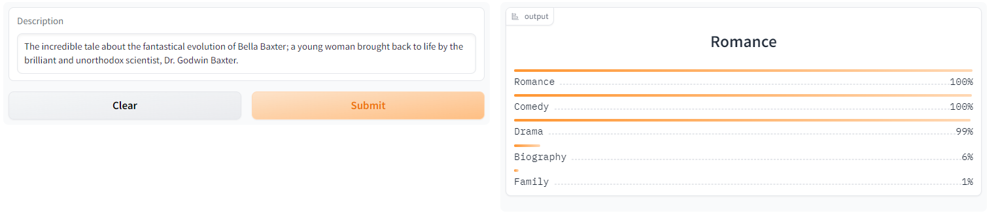
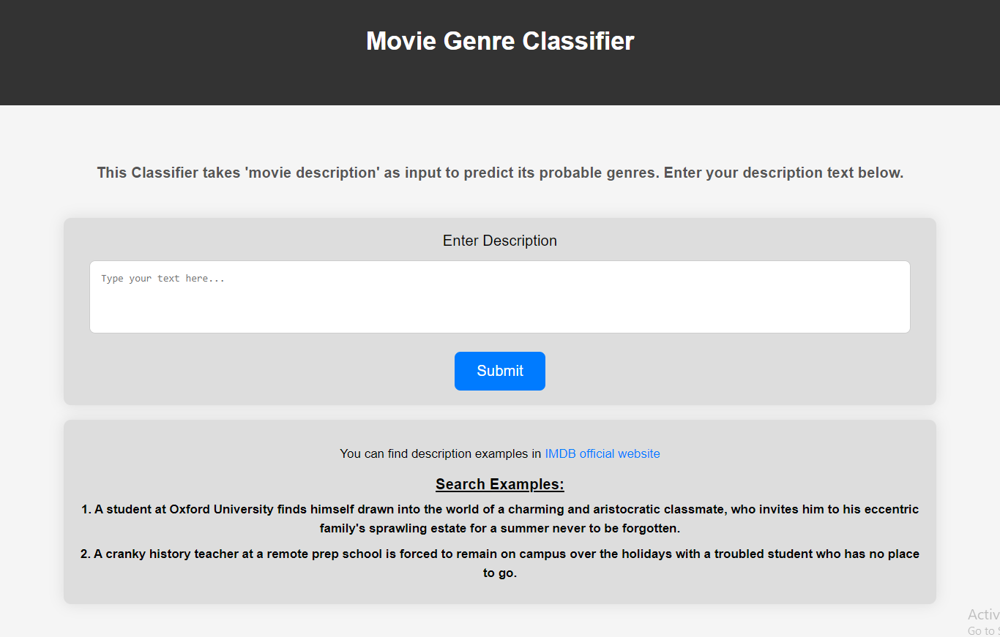
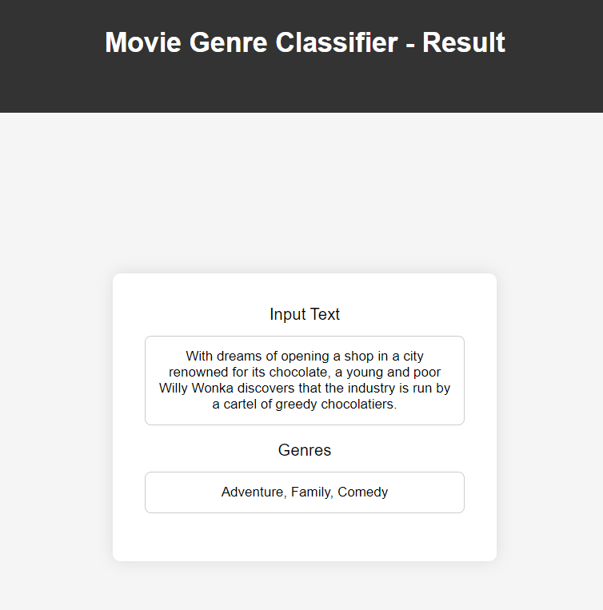

# MULTILABEL MOVIE GENRE CLASSIFIER

## Objective
The goal of this project was to build a multi-label text classification model that can predict movie genres from its description. The project includes data collection, cleaning, model training, deployment, and API integration.  
The model can classify 21 different types of book genres  The keys of `deployment\genre_types_encoded.json` shows the book genres

 ## Data Collection

Data was collected from [IMDB official Website](https://www.imdb.com/search/title/?title_type=feature) Listing.   

**Movie Details Scraping:** movie title, description and genres are scraped using selenium library. The code can be found in `scraper/scrape.py` folder.

In total, 13,001 movie details were scraped till 1/8/24. The collection process is still in progress. the data are stored in `data/movie_data.csv`. 
Update : 19500 movies collected(yet to be trained)

## Data Preprocessing

Initially, duplicates and missing values were dropped. After that, two of the 23 genres(Film and Noir) were dropped as those genres are rare and training with them could potentially drop the accuracy of the model. The preprocessing can be found in `notebooks/Project_NLP.ipynb`. The cleaned dataset can be found in `data` folder.

## Model Training

Finetuned a `distilrobera-base` model from HuggingFace Transformers using Fastai and Blurr. After five stages of training(with freeze and unfreeze), the best model was chosen to deploy(accuracy == 89.7). The model training notebook can be found in `notebooks/Project_NLP.ipynb`

## Model Compression and ONNX Inference

The trained model has a memory of 300+MB. This model was compressed using ONNX quantization and brought under 80MB. The compression code can be found in `notebooks/ONNX_Inference.ipynb` and the model can be found in `models` folder.

## Model Deployment

The compressed model is deployed to HuggingFace Spaces Gradio App. The implementation can be found in `deployment` folder.  Hugging face Space [link here](https://huggingface.co/spaces/mhdhrubo/movie-genre_classifier)

## Web Deployment
Deployed a Flask App built to take descprition and show the genres as output. Check the `flask ` branch or [click here](https://github.com/moinul-hossain-dhrubo/MultiLabel-Movie-Genre-Classifier/tree/flask). The website is live [here](https://multilabel-movie-genre-classifier.onrender.com/) 

